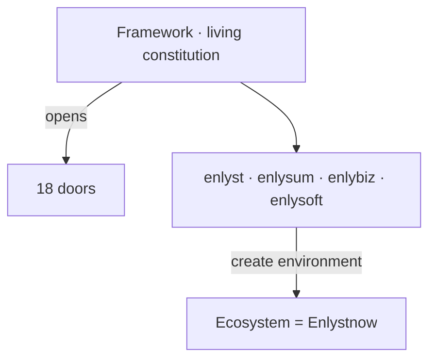

# 01 — Taxonomy

> **★ Ontology (read first):** [VISION.md](VISION.md) · [docs/ENLYSTNOW_ONTOLOGY.md](docs/ENLYSTNOW_ONTOLOGY.md)

## Correct relationships (locked)

```
Enlyst Framework (manifesto / living constitution)
    ├── opens gates → 18 doors
    └── four practices under it:
            enlyst | enlysum | enlybiz | enlysoft
                └── create → Ecosystem = Enlystnow
                    (legacy craft name: Showreel)
```



**Wrong:** Enlystnow “above” the practices, Holding-style umbrella stacking, Ecosystem as a layer above practices.  
**Right:** Framework enables; practices create the Ecosystem environment (= Enlystnow).

## Enlyst Framework

**Manifesto · living constitution.** Gold chrome. Allows Ecosystem Enlystnow to thrive. Opens gates to the **18 doors**. Constitutional surface / door 05 — not a consumer site that replaces practice roots, and not a Holding. See [05-FRAMEWORK-ADMIN.md](05-FRAMEWORK-ADMIN.md).

## Four practices (operating)

| Practice | Accent (SoT) | Public host |
|----------|--------------|-------------|
| **enlyst** | `#2D5BE3` HR blue | `enlystnow.com` (root) |
| **enlysum** | `#1A7A4A` finance green | `enlystnow.com/enlysum/` (temp) |
| **enlybiz** | `#C4620A` biz amber | `enlybiz.com` |
| **enlysoft** | `#6B3FA0` tech purple | `enlysoft.net` |

Each practice keeps a **unique color system** and public voice. Do not collapse accents. `enlystnow.com` root is **enlyst** Smart Recruiting — not “Enlystnow the brand site.”

## Ecosystem = Enlystnow

| | |
|--|--|
| **Primary** | Environment created by the four practices under the Framework |
| **Synonyms** | environment · umbrella · entity · symbol · founders hub · board of directors (domain Members) · philosophy · ideology · signpost |
| **Was** | Showreel (legacy craft / disk names) |
| **URL** | `https://enlystnow.com/ecosystem/` |
| **Snapshot** | `Design-Libraries/06-showreel-snapshot/…` (legacy folder; docs say Enlystnow Ecosystem) |
| **Not** | Consumer brand · Holding · layer above practices |

### Board face (same referent)

Enlystnow may be spoken as a **board of directors / founders hub** with domain **Members** (Technology, Marketing, HR, Healthcare, …). Likely practice maps: HR↔enlyst · Technology↔enlysoft · Marketing↔enlybiz. Healthcare and other seats stay **open** — do not invent practices. Doors ≠ Members. Detail: [docs/ENLYSTNOW_ONTOLOGY.md](docs/ENLYSTNOW_ONTOLOGY.md) § Board.

Craft (atmosphere, motion, door theatre) for practice pages comes from this **Enlystnow Ecosystem** craft bar while copy stays practice-native. See [08-ECOSYSTEM-SHOWCASE.md](08-ECOSYSTEM-SHOWCASE.md) and [docs/INVENTION_MANDATE.md](docs/INVENTION_MANDATE.md).

## Eighteen doors

Framework **opens gates** to each door. Unique color per door (`--door-NN-*`). Beautifully defined; motion and craft apply. See [07-DOORS.md](07-DOORS.md).

## Attributes (implementation)

```html
<html data-arm="enlyst" data-intensity="standard">
<body data-door="01" data-register="">
```

| Attribute | Required host | Values | Effect |
|-----------|---------------|--------|--------|
| `data-arm` | `<html>` | `enlyst` \| `enlysum` \| `enlybiz` \| `enlysoft` \| `framework` \| `enlystnow` | Sets `--accent*` + `--glow-*` |
| `data-intensity` | `<html>` (mandatory, explicit) | `calm` \| `standard` \| `cinematic` | Sets motion tier tokens |
| `data-door` | any element | `01` … `18`, or the slug alias | Overrides `--accent*` to that door |
| `data-register` | any element | `vision` \| `entity` \| `institution` \| `standard` \| `umbrella` \| `ecosystem` | **Semantic only — no styling** |

**Host rules.** `data-arm` and `data-intensity` belong on `<html>`; `<html>` must always carry an explicit `data-intensity` value rather than relying on the default. A nested stage wrapper may override `data-intensity` for one sub-region; `prefers-reduced-motion: reduce` overrides every tier.

`cinematic` — Enlystnow Ecosystem showcase (`/ecosystem/`) only, plus rare admin demos. Practice pages, products and docs use `calm` or `standard`.

`data-register` values are defined in [04-ENLYSTNOW-ADMIN.md](04-ENLYSTNOW-ADMIN.md), which is the source for register semantics. Legacy aliases `data-division` and `.scope-*` are documented in [06-OPERATING-ARMS.md](06-OPERATING-ARMS.md).
