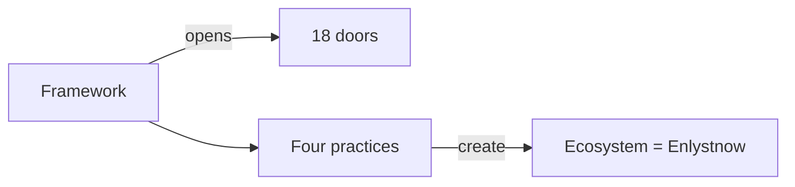

# 05 — Enlyst Framework (living constitution)

> **★ Ontology:** [VISION.md](VISION.md) · [docs/ENLYSTNOW_ONTOLOGY.md](docs/ENLYSTNOW_ONTOLOGY.md)

## Role (locked)

**Enlyst Framework = manifesto · living constitution.**

- **Allows** Ecosystem Enlystnow to **thrive**.  
- **Opens gates** to the **18 doors**.  
- Four practices (enlyst, enlysum, enlybiz, enlysoft) operate **under** the Framework and together **create** the Ecosystem environment (= Enlystnow).  
- Gold chrome: `--admin-framework` / `--framework-gold` `#C4A24A`.  
- **Framework badge never spins.**

Framework is **not** a consumer website brand and **not** a Holding. It is constitutional — method, adoption, Safe Zone / Fortress interpretation — that keeps practices coherent without erasing their mandates.

## Public expression

- **Door 05** on Ecosystem maps and path maps (Framework as a *surface*, not a vanity homepage).  
- Optional method pages under `enlystnow.com/framework/` — never replace enlyst practice root.  
- Linked from Ecosystem and path map.

## Color

| Token | Hex |
|-------|-----|
| `--door-05` / `--admin-framework` | `#C4A24A` |
| Pale | `#FAF4E2` |

## Relationship (do not invert)

```
Framework (constitution)
  → opens 18 doors
  → four practices under it create Ecosystem = Enlystnow
```



Do **not** describe Enlystnow or Ecosystem as sitting “above” the practices or Framework.
