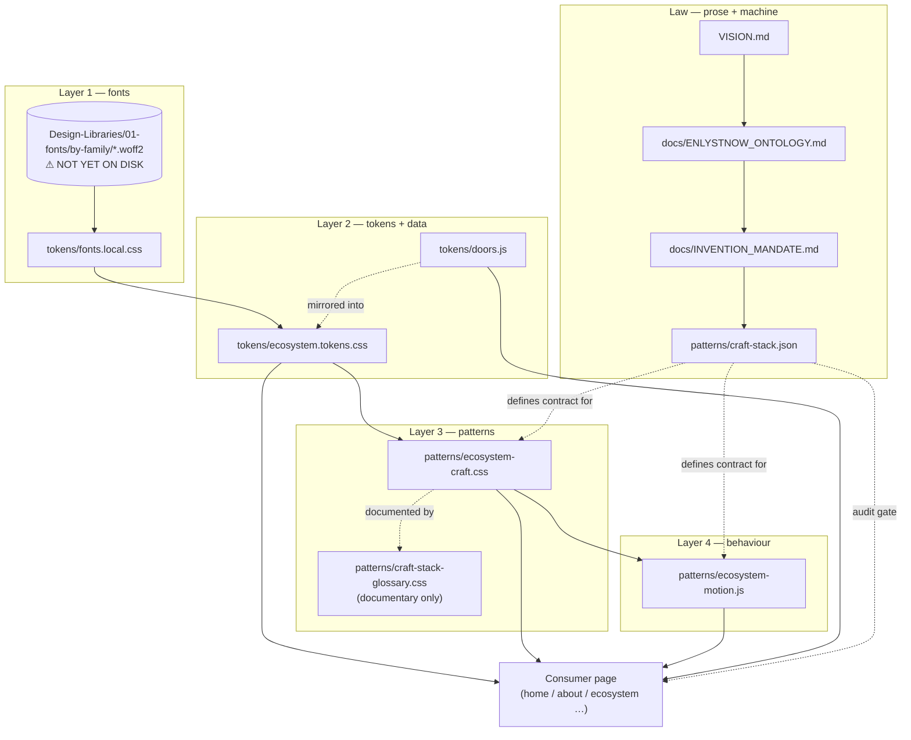

# Conventions — naming, import order, dependency graph, sync rules

**Status:** Binding · DS v1.1.0 · Updated 2026-08-06
**Role:** the mechanical contract. How files are named, what depends on what, in which order things load, and which mirrors must be kept in sync.

---

## 1. Layer model

The DS has exactly four runtime layers. Nothing may reach *backwards* to a higher-numbered layer.

| Layer | Artefact | May reference | Must not reference |
|-------|----------|---------------|--------------------|
| **1 · Fonts** | `tokens/fonts.local.css` | Font binaries only | Any token, any class |
| **2 · Tokens** | `tokens/ecosystem.tokens.css`, `tokens/doors.js` | Layer 1 families | Craft pattern classes |
| **3 · Patterns** | `patterns/ecosystem-craft.css` | Layer 2 custom properties | Page-specific selectors |
| **4 · Behaviour** | `patterns/ecosystem-motion.js` | Layer 3 classes, `data-*` attributes | Hard-coded colours or sizes |

Consumer pages sit outside and above all four. A page may use tokens and pattern classes; it may not redefine them.

---

## 2. Dependency graph



**Reading the graph:** solid arrows are load-time dependencies; dotted arrows are authority or mirroring relationships that a human or agent must maintain.

---

## 3. Import order — never reorder

```html
<!-- 1 fonts -->
<link rel="stylesheet" href="/00-enlyst-ds/tokens/fonts.local.css" />
<!-- 2 tokens -->
<link rel="stylesheet" href="/00-enlyst-ds/tokens/ecosystem.tokens.css" />
<!-- 3 patterns -->
<link rel="stylesheet" href="/00-enlyst-ds/patterns/ecosystem-craft.css" />
<!-- page-specific CSS goes here, after all DS layers -->
<!-- 2b door data — only on pages that build door lists in JS -->
<script defer src="/00-enlyst-ds/tokens/doors.js"></script>
<!-- 4 behaviour -->
<script defer src="/00-enlyst-ds/patterns/ecosystem-motion.js"></script>
```

**Why the order is load-bearing.** `@font-face` must be registered before any rule references `--font-serif`. Pattern rules consume token custom properties, so the token file must cascade first. `ecosystem-craft.css` re-declares the wordmark, glass and `.framework-badge` rules with `!important` specifically to win against inherited page CSS — putting page CSS *before* it would defeat that. `doors.js` must load before `ecosystem-motion.js` on pages that render doors dynamically.

**Never** add a font CDN `@import`. The snapshot reference files under `_incoming/` still contain a Bunny import; they are reference material and must never be linked from a page.

---

## 4. File naming

| Pattern | Meaning | Examples |
|---------|---------|----------|
| `NN-SCREAMING-KEBAB.md` at DS root | Numbered reference chapter, read in sequence | `01-TAXONOMY.md`, `07-DOORS.md` |
| `VISION.md` at DS root | The one unnumbered root doc — deliberately first, before `01` | — |
| `README.md` at DS root | Index and map only. Contains no law of its own. | — |
| `docs/SCREAMING_SNAKE.md` | Binding law, handoff or reference that is not part of the numbered sequence | `INVENTION_MANDATE.md`, `GLOSSARY.md` |
| `tokens/*.css` | Layer 1–2 | `fonts.local.css`, `ecosystem.tokens.css` |
| `tokens/*.js` | Machine data registry | `doors.js` |
| `patterns/*.css` / `*.js` | Layer 3–4 | `ecosystem-craft.css`, `ecosystem-motion.js` |
| `patterns/*.json` | Machine contract | `craft-stack.json` |
| `preview/*.html` | Local, `noindex` preview surfaces | `ds-index.html` |
| `seo/*` | SEO operations artefacts | `redirect-map.template.csv` |
| `_incoming/**` | **Read-only reference paste.** Never imported, never edited to fix DS problems. | `_incoming/colors_and_type.css` |

**Numbered filenames are frozen.** `04-ENLYSTNOW-ADMIN.md` and `06-OPERATING-ARMS.md` carry outdated words in their names. They are kept so the 01–13 sequence stays gap-free and existing links keep resolving. Each opens with a filename note explaining the discrepancy. Renaming them is a future breaking change, not a fix.

### Token naming

| Rule | Example |
|------|---------|
| Kebab-case, lowercase | `--arm-enlyst-pale` |
| Alpha variants suffix the percentage | `--door-07-58` = base at 58% alpha |
| Pale variants suffix `-pale` | `--door-07-pale` |
| Doors are zero-padded to two digits | `--door-07`, never `--door-7` |
| Semantic tokens alias raw ones, never the reverse | `--fg-2: var(--ink-2)` |

### Class naming

| Prefix / shape | Meaning | Example |
|----------------|---------|---------|
| `.band-*` | Section-owned palette | `.band-theatre` |
| `.b-*` | Bento and spine primitives (from the snapshot) | `.b-cell`, `.b-c6`, `.b-spine-node` |
| `.is-*` | State or variant modifier | `.is-courage`, `.is-wisdom` |
| `.rv` / `.rv.on` | Reveal target and its active state | — |
| `.glow-*` | Glow utility | `.glow-brass` |
| `[data-*]` | Scope or tier, never decoration | `[data-door="09"]` |

---

## 5. Sync rules — the declared mirrors

Some facts must exist in more than one place for the system to work (machine data, human tables, CSS). Each has one authority and an explicit propagation path. **A mirror that drifts is a bug in the mirror, never in the authority.**

### Door sync rule

Authority: [`../tokens/doors.js`](../tokens/doors.js)

1. Edit `doors.js`. It asserts uniqueness of number, slug, colour and pale at load, and asserts exactly 18 entries — it throws rather than shipping a duplicate.
2. Mirror into `tokens/ecosystem.tokens.css`: the `--door-NN*` block **and** the matching `[data-door]` rule.
3. Mirror the row in `07-DOORS.md`.
4. Bump `CHANGELOG.md`.

### Craft pattern sync rule

Authority: [`../patterns/craft-stack.json`](../patterns/craft-stack.json)

1. Edit the JSON — pattern ID, class contract, page minimums, audit gate.
2. Mirror the §4 tables in `docs/INVENTION_MANDATE.md`.
3. Mirror the class list in `patterns/craft-stack-glossary.css`.
4. Implement or adjust `patterns/ecosystem-craft.css`.
5. Add or update the demo section in `preview/ds-index.html`.
6. Bump `CHANGELOG.md`.

### Ontology sync rule

Authority: [`../VISION.md`](../VISION.md)

`docs/ENLYSTNOW_ONTOLOGY.md` is its canonical twin — same content, doc-shaped. Every other file that states the ontology (`README.md`, `01-TAXONOMY.md`, `05-FRAMEWORK-ADMIN.md`, `08-ECOSYSTEM-SHOWCASE.md`, `docs/INVENTION_MANDATE.md`, `patterns/craft-stack.json`, the CSS file headers, `preview/ds-index.html`, and the external `MANDATE_ECOSYSTEM_INVENTION.md`) restates it in **compressed** form and must not add, soften or reorder a claim.

### Intentional duplication that is *not* a mirror

The wordmark, glass and `.framework-badge` rules exist in both the token layer and the pattern layer. Both read the same custom properties, so no value can diverge — only the `!important` enforcement differs. This is by design and needs no sync step. Change values in `tokens/ecosystem.tokens.css` only.

---

## 6. Authority order — who wins a disagreement

When two artefacts conflict, resolve downward through this list. The first entry that speaks to the question wins.

1. **The user's explicit instruction** (recorded in [DECISION_LOG.md](DECISION_LOG.md))
2. **`VISION.md`** — the ontology, and anything that follows from it
3. **`docs/GLOSSARY.md`** — what a word means
4. **Machine SoT** — `patterns/craft-stack.json` for craft; `tokens/doors.js` for doors
5. **`docs/INVENTION_MANDATE.md`** — craft law in prose
6. **`tokens/ecosystem.tokens.css`** — token values
7. **Numbered chapters `01`–`13`** — reference detail
8. **`README.md`** — index only; it never wins, because it holds no law
9. **`_incoming/**` and `06-showreel-snapshot/**`** — historical reference; never wins anything

---

## 7. Editing rules

- **Never edit `_incoming/`** to fix a DS problem. It is an immutable paste of upstream reference.
- **Never edit `06-showreel-snapshot/`.** It is the historical north star; its `SECTORS.md` framing is superseded by `VISION.md` but the files stay untouched.
- **Never delete a legacy alias** (`data-division`, `--hr-blue`, `.scope-*`) — snapshot CSS still resolves through them.
- **Add, don't fork.** New tokens go into `ecosystem.tokens.css`; new patterns into `ecosystem-craft.css`. A second token file would create two sources of truth.
- **Every new pattern needs five things** before it counts as shipped: a JSON entry, CSS, a glossary line, a preview demo, and a CHANGELOG line.
- **Bump `CHANGELOG.md`** on every change to tokens, patterns, doors or ontology.

---

## 8. Versioning

Semantic, tracked in [CHANGELOG.md](CHANGELOG.md) and mirrored in `patterns/craft-stack.json` → `version`.

| Bump | Trigger |
|------|---------|
| **Major** | Ontology change; a pattern removed or renamed; import order change |
| **Minor** | New pattern; new token family; new door; page minimums tightened |
| **Patch** | Value correction; doc clarification; typo; broken link |
