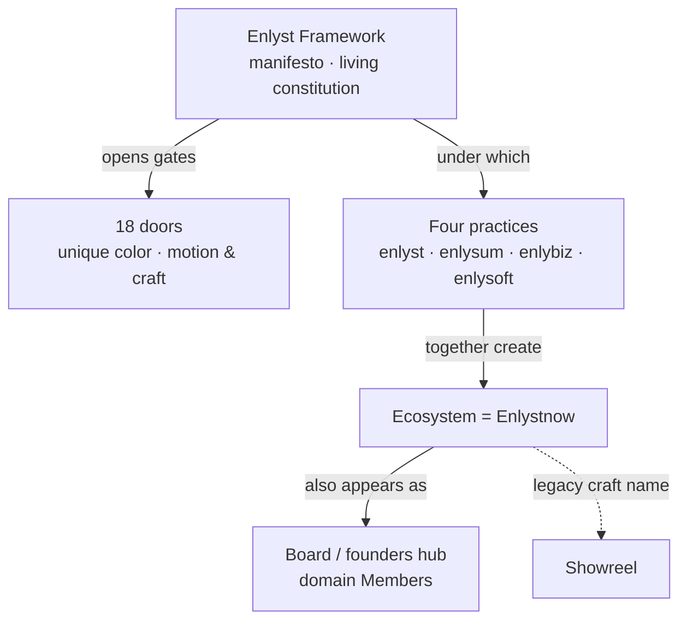

# Enlystnow Ontology (canonical)

**Status:** Binding · read before any DS, mandate, or public-surface edit  
**Updated:** 2026-08-06 · **supersedes** any “Enlystnow above the arms” framing  
**Centerpiece twin:** [../VISION.md](../VISION.md)

---

## Authoritative relationships

```
Enlyst Framework (manifesto / living constitution)
    ├── enables & opens → 18 doors (gates)
    └── under which four practices operate:
            enlyst | enlysum | enlybiz | enlysoft
                └── together create → Ecosystem environment = Enlystnow
                    ├── (legacy craft name: Showreel)
                    └── also appears as → Board of directors / founders hub
                            Members: Technology · Marketing · HR · Healthcare · …
```



| Role | What it is |
|------|------------|
| **Enlyst Framework** | Manifesto · **living constitution**. Allows the Ecosystem to thrive. Opens gates to the **18 doors**. |
| **Four practices** | enlyst · enlysum · enlybiz · enlysoft — operate **under** the Framework |
| **Ecosystem** | The **environment** those four practices **create together** |
| **Enlystnow** | **= Ecosystem** — same environment (not a layer above the practices) |
| **Board / Members** | Institutional **face** of Enlystnow — domain seats at the founders hub (see below) |
| **Showreel** | Legacy craft name for that Ecosystem / Enlystnow environment |
| **18 doors** | Gates Framework opens — beautifully defined unique colors; motion and craft apply |

**One line:** Framework (constitution) → four practices under it → they create Ecosystem = Enlystnow (was Showreel; also board face with Members).

---

## Enlystnow as board of directors (canonical synonym)

This is **another face of the same referent**, not a second tier and not a Holding.

| Face | When to use it |
|------|----------------|
| Ecosystem / environment | Craft, public `/ecosystem/`, invention mandate |
| Board / founders hub / Members | Institutional register, governance voice, founders narrative |

### Domain Members (user structure — do not invent politics)

| Board seat | Mapping to practices / doors | Status |
|------------|------------------------------|--------|
| **Member HR** | ↔ **enlyst** (Smart Recruiting / HR & Talent; door 01 lineage) | **Likely** — treat as the practice correspondence unless the user amends |
| **Member Technology** | ↔ **enlysoft** (Technology; door 04 lineage) | **Likely** |
| **Member Marketing** | ↔ **enlybiz** (Marketing; door 03 lineage) | **Likely** |
| **Member Healthcare** | Board-domain seat under Enlystnow | **Open** — no dedicated practice brand and no dedicated door in the current 18; do **not** invent a healthcare practice or door to fill the seat |
| **Other Members** | As applicable | **Open** — name the seat; do not invent a matching practice |

**Intentionally unmapped:** **enlysum** (Finance) has no named Member in the user’s board list — leave explicit until the user assigns a seat. Board seats are **not** the same thing as the 18 doors; doors remain Framework gates.

### Hard rules for the board face

1. Does **not** replace `Ecosystem = Enlystnow`.  
2. Does **not** put Enlystnow / Ecosystem / the board **above** the practices.  
3. Does **not** make Enlystnow a consumer brand on practice pages.  
4. Does **not** invent fake practice brands for unmapped seats (esp. Healthcare).  
5. Never “Holding” / “mother company” — board language is founders-hub / institutional, not corporate parentage.

---

## Terminology chain

| Legacy / disk | Current name | Meaning |
|---------------|--------------|---------|
| **Showreel** | **Ecosystem** | Craft / invention surface of the environment. Legacy folders (`06-showreel-snapshot`, `showreel.css`) stay on disk. |
| **Ecosystem** | **Enlystnow** | Same environment — not a separate brand tier, not above the practices. |
| **Board / Members** | **Enlystnow** (institutional face) | Same environment, spoken as founders hub with domain seats. |

---

## What Enlystnow / Ecosystem IS

**Primary definition:** the **environment created by the four practices under the Framework**.

Optional synonyms (docs / internal — never as “above the practices”):

| Synonym | Role |
|---------|------|
| **environment** | Primary — shared field the practices create |
| **umbrella** | Shared canopy of meaning (not a Holding) |
| **entity** | Institutional whole (not a consumer product) |
| **symbol** | Shared mark / meaning |
| **founders hub** | Origin, philosophy, signposting |
| **board of directors** | Institutional face — domain **Members** at the founders hub |
| **philosophy** | Values, Himat–Hikmat, intent |
| **ideology** | How the system thinks |
| **signpost** | Orients across practices and 18 doors |

Enlystnow is **not a brand** in the consumer/marketing sense. Public practice pages do not sell “Enlystnow” as a product.

---

## What is WRONG (do not write)

| Wrong framing | Correct |
|---------------|---------|
| Enlystnow **above** the four practices | Practices create Ecosystem = Enlystnow **under** Framework |
| Ecosystem as a layer **above** practices | Ecosystem **is** the environment practices create |
| Board as a parent company owning practices | Board is a **face of** Enlystnow, not a Holding above them |
| Member seats = invented practice brands | Map only where likely; leave Healthcare and others **open** |
| Enlystnow as consumer brand / Holding | Forbidden |
| Framework as “just method, not constitution” | Framework = **manifesto / living constitution** |
| Showreel as current public product name | Showreel = **legacy craft name** only |

Never use **Holding** in public copy.

---

## Public surfaces (copy vs craft)

| Surface | Voice | Craft source |
|---------|-------|--------------|
| `enlystnow.com/` | **enlyst** Smart Recruiting (practice) | Enlystnow Ecosystem craft bar |
| `enlystnow.com/about.html` | enlyst story | Ecosystem-level invention |
| `enlystnow.com/ecosystem/` | Environment / path theatre | Full Enlystnow Ecosystem stage |
| enlybiz.com · enlysoft.net | Respective practice | Same craft bar when on DS |

CTA: “Experience the ecosystem” → `/ecosystem/` — not “Welcome to Enlystnow.”

---

## File references

| Doc | Path |
|-----|------|
| **VISION centerpiece** | [../VISION.md](../VISION.md) |
| Taxonomy | [01-TAXONOMY.md](../01-TAXONOMY.md) |
| Framework | [05-FRAMEWORK-ADMIN.md](../05-FRAMEWORK-ADMIN.md) |
| Ecosystem showcase | [08-ECOSYSTEM-SHOWCASE.md](../08-ECOSYSTEM-SHOWCASE.md) |
| Invention mandate | [INVENTION_MANDATE.md](INVENTION_MANDATE.md) |
| Craft CSS / motion | [../patterns/ecosystem-craft.css](../patterns/ecosystem-craft.css) · [../patterns/ecosystem-motion.js](../patterns/ecosystem-motion.js) |
| Preview | [../preview/ds-index.html](../preview/ds-index.html) |
| Handoff mandate | `D:\ENLYST PVT\Enlyst\MANDATE_ECOSYSTEM_INVENTION.md` |
| Snapshot (legacy folder) | `Design-Libraries/06-showreel-snapshot/from-F-Enlystnow-showreel/` |
