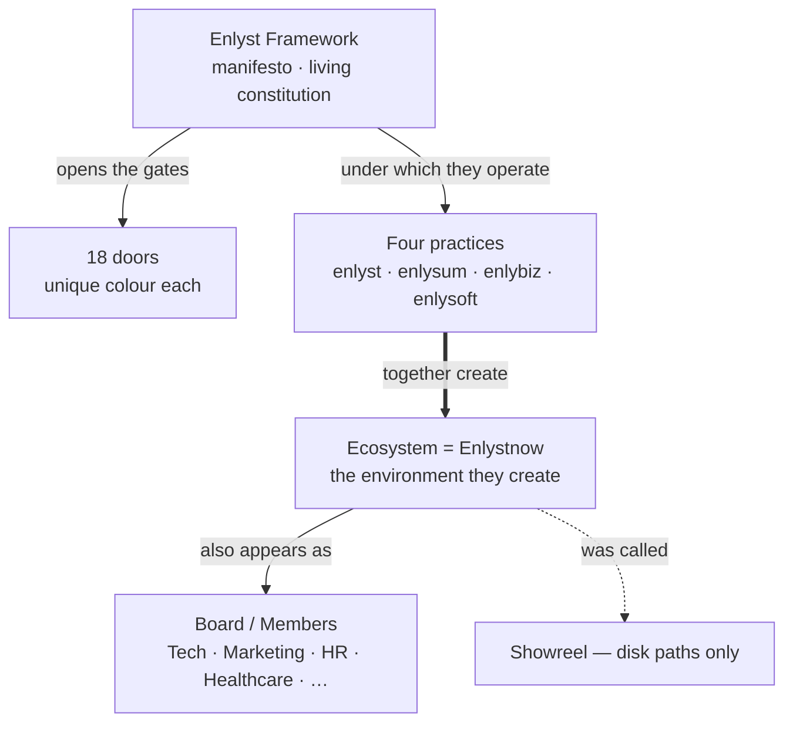
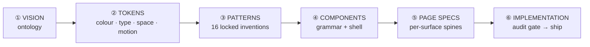

# Enlyst Ecosystem Design System

**Version:** 1.1.0 · **Updated:** 2026-08-06
**Path:** `D:\Enlyst.Org\Enlystnow\Design-Libraries\00-enlyst-ds\`

> ### → New here? Read **[docs/OPUS_HANDOFF.md](docs/OPUS_HANDOFF.md)** first.
> It is the entry point: executive summary, read order, file map, known constraints and a validation checklist.
> **Then open [`preview/ds-index.html`](preview/ds-index.html)** in a browser to see all sixteen craft patterns live.

**This README is an index. It holds no law of its own** — per [docs/CONVENTIONS.md](docs/CONVENTIONS.md) §6 it never wins a disagreement with the documents it points to.

---

## ★ The ontology (binding — [VISION.md](VISION.md))

```
Enlyst Framework (manifesto · living constitution)
  → opens the gates to 18 doors
  → four practices operate under it: enlyst · enlysum · enlybiz · enlysoft
        └── together they CREATE → the Ecosystem environment = Enlystnow
            ├── legacy craft name: Showreel
            └── also appears as → Board of directors / founders hub
                    Members: Technology · Marketing · HR · Healthcare · …
```



| Locked truth | |
|--------------|--|
| **Framework** | Manifesto and living constitution. Enables the Ecosystem to thrive; opens the **18 doors**. Gold `#C4A24A`, door 05. |
| **Four practices** | enlyst · enlysum · enlybiz · enlysoft — they **create** the Ecosystem environment under the Framework |
| **Ecosystem = Enlystnow** | The same environment. Umbrella, entity, symbol, founders hub, philosophy, ideology, signpost. |
| **Board / Members** | Canonical **synonym face** of Enlystnow (founders hub). Likely: HR↔enlyst, Technology↔enlysoft, Marketing↔enlybiz. Healthcare and other seats **open** — no invented practices. Does **not** put Ecosystem above practices. |
| **Showreel** | Legacy craft name only — disk paths and filenames |
| **NOT** | Ecosystem or Enlystnow above the practices · Holding · Enlystnow as a consumer brand · Framework as a homepage · board as a Holding |

**The direction of creation runs upward from the practices.** They create the Ecosystem; it does not contain them.

**Domain ≠ brand:** `enlystnow.com/` is the **enlyst** practice root (Smart Recruiting). Enlystnow is the environment, exhibited at `/ecosystem/`.

Canonical twin: **[docs/ENLYSTNOW_ONTOLOGY.md](docs/ENLYSTNOW_ONTOLOGY.md)** · Vocabulary: **[docs/GLOSSARY.md](docs/GLOSSARY.md)**

---

## Structure — how this package is organised



Six stages, each with one owner document. Nothing skips a stage.

| Stage | Owner | Also |
|-------|-------|------|
| ① Vision / ontology | [VISION.md](VISION.md) | [docs/ENLYSTNOW_ONTOLOGY.md](docs/ENLYSTNOW_ONTOLOGY.md) · [docs/GLOSSARY.md](docs/GLOSSARY.md) · [01-TAXONOMY.md](01-TAXONOMY.md) |
| ② Tokens | [09-TOKENS.md](09-TOKENS.md) | [tokens/](tokens/) · [07-DOORS.md](07-DOORS.md) · [10-TYPE-AND-MOTION.md](10-TYPE-AND-MOTION.md) · [docs/FONT_LOADING.md](docs/FONT_LOADING.md) |
| ③ Patterns | [docs/INVENTION_MANDATE.md](docs/INVENTION_MANDATE.md) §4 | [patterns/](patterns/) · [preview/ds-index.html](preview/ds-index.html) |
| ④ Components | [12-COMPONENTS.md](12-COMPONENTS.md) | [11-LOGOS-AND-MARKS.md](11-LOGOS-AND-MARKS.md) |
| ⑤ Page specs | [docs/PAGE_SPECS.md](docs/PAGE_SPECS.md) | [13-SURFACE-MATRIX.md](13-SURFACE-MATRIX.md) · [02-DOMAIN-MAP.md](02-DOMAIN-MAP.md) |
| ⑥ Implementation | [docs/OPUS_HANDOFF.md](docs/OPUS_HANDOFF.md) | [docs/CONVENTIONS.md](docs/CONVENTIONS.md) · [docs/INVENTION_MANDATE.md](docs/INVENTION_MANDATE.md) §5 audit gate |

---

## Complete index

### Entry points

| File | Role |
|------|------|
| **[docs/OPUS_HANDOFF.md](docs/OPUS_HANDOFF.md)** | **Start here.** Summary, read order, file map, constraints, validation checklist |
| **[VISION.md](VISION.md)** | The binding ontology — step 0 of every read order |
| **[preview/ds-index.html](preview/ds-index.html)** | Live demo of all 16 patterns, the 18 doors, the intensity switcher |
| [CHANGELOG.md](CHANGELOG.md) | Version history — current 1.1.0 |

### `docs/` — law and handoff

| File | Role |
|------|------|
| [ENLYSTNOW_ONTOLOGY.md](docs/ENLYSTNOW_ONTOLOGY.md) | Canonical twin of VISION; wrong-vs-right framings |
| [INVENTION_MANDATE.md](docs/INVENTION_MANDATE.md) | **Craft law** — §4 the sixteen patterns and page minimums, §5 the audit gate |
| [GLOSSARY.md](docs/GLOSSARY.md) | Terms, aliases, forbidden words, exact spellings, disambiguation traps |
| [CONVENTIONS.md](docs/CONVENTIONS.md) | Layers, dependency graph, import order, naming, sync rules, authority order |
| [PAGE_SPECS.md](docs/PAGE_SPECS.md) | Section-by-section spines per surface |
| [FONT_LOADING.md](docs/FONT_LOADING.md) | Font standard, the curly-y fix, asset manifest, **the one open blocker** |
| [DECISION_LOG.md](docs/DECISION_LOG.md) | 25 resolved conflicts + 5 tracked open items |

### Numbered reference chapters

Reference sequence, **not** a reading sequence — use the read order in the handoff.

| # | File | Role |
|---|------|------|
| 01 | [01-TAXONOMY.md](01-TAXONOMY.md) | Relationships + the `data-*` attribute contract |
| 02 | [02-DOMAIN-MAP.md](02-DOMAIN-MAP.md) | Hosts, path map, canonical host rules, redirect plan |
| 03 | [03-SEO-AND-REDIRECTS.md](03-SEO-AND-REDIRECTS.md) | Retiring the buried WordPress install; 301 discipline |
| 04 | [04-ENLYSTNOW-ADMIN.md](04-ENLYSTNOW-ADMIN.md) | Enlystnow / Ecosystem institutional register; `data-register` *(legacy filename)* |
| 05 | [05-FRAMEWORK-ADMIN.md](05-FRAMEWORK-ADMIN.md) | The Framework as living constitution; gold; door 05 *(legacy filename)* |
| 06 | [06-OPERATING-ARMS.md](06-OPERATING-ARMS.md) | The four practices — accents, hosts, spellings, aliases *(legacy filename)* |
| 07 | [07-DOORS.md](07-DOORS.md) | The 18 doors — colours, pales, provenance, stewards, statuses |
| 08 | [08-ECOSYSTEM-SHOWCASE.md](08-ECOSYSTEM-SHOWCASE.md) | The `/ecosystem/` surface brief and naming chain |
| 09 | [09-TOKENS.md](09-TOKENS.md) | **Token index** — every family, hook and utility |
| 10 | [10-TYPE-AND-MOTION.md](10-TYPE-AND-MOTION.md) | Type roles and the three motion tiers |
| 11 | [11-LOGOS-AND-MARKS.md](11-LOGOS-AND-MARKS.md) | Mark-per-surface rules; the wordmark law |
| 12 | [12-COMPONENTS.md](12-COMPONENTS.md) | Component grammar and the site shell |
| 13 | [13-SURFACE-MATRIX.md](13-SURFACE-MATRIX.md) | Surface × identity × accent × intensity × indexing |

*Filenames 04 and 06 name concepts the ontology has retired. They are frozen for link stability and each opens with a correction note — see [docs/DECISION_LOG.md](docs/DECISION_LOG.md) D-19.*

### Implementation assets

| File | Layer | Role |
|------|-------|------|
| [tokens/fonts.local.css](tokens/fonts.local.css) | 1 | `@font-face` only. Local, no CDN. **Production contract.** |
| [tokens/ecosystem.tokens.css](tokens/ecosystem.tokens.css) | 2 | All custom properties + base typography utilities |
| [tokens/doors.js](tokens/doors.js) | 2 | **Machine registry** for the 18 doors, self-asserting uniqueness |
| [tokens/fonts.dev-fallback.css](tokens/fonts.dev-fallback.css) | — | Preview-only CDN fallback. **Never ship.** |
| [patterns/craft-stack.json](patterns/craft-stack.json) | — | **Machine SoT** — pattern IDs, classes, page minimums, audit gate |
| [patterns/ecosystem-craft.css](patterns/ecosystem-craft.css) | 3 | The 16 patterns, implemented |
| [patterns/ecosystem-motion.js](patterns/ecosystem-motion.js) | 4 | Scroll reveal, intensity resolution, badge freeze |
| [patterns/craft-stack-glossary.css](patterns/craft-stack-glossary.css) | — | Human class map. Documentary — no live styles. |

### Operations and reference

| Path | Role |
|------|------|
| [seo/](seo/) | cPanel / WordPress findings, redirect worksheet, sitemap and robots policy |
| `_incoming/` | **Immutable reference paste.** Never imported, never edited. Still contains a Bunny `@import`. |

### External

| Path | Role |
|------|------|
| `D:\ENLYST PVT\Enlyst\MANDATE_ECOSYSTEM_INVENTION.md` | Live project state — agent roster, page queue, election status |
| `D:\ENLYST PVT\Enlyst\home\index.html` | The **elected** home (2026-08-04). Chrome baseline. |
| `..\06-showreel-snapshot\from-F-Enlystnow-showreel\` | Craft north star. Historical; its "mother platform" framing is superseded. |

**Ownership split:** this DS owns the *law* — ontology, tokens, patterns, page specs, audit gate. The external mandate owns *live project state*. Neither restates the other.

---

## Public surfaces

| Host / path | Surface | Identity | Intensity |
|-------------|---------|----------|-----------|
| `https://enlystnow.com/` | Practice root + path map | **enlyst** | `standard` |
| `https://enlystnow.com/ecosystem/` | Enlystnow Ecosystem showcase | the environment | `cinematic` |
| `https://enlystnow.com/paths/` | Path map — 4 practices + 18 doors | enlyst chrome | `standard` |
| `https://enlystnow.com/framework/` | Framework method pages (optional) | Framework | `calm` / `standard` |
| `https://enlystnow.com/enlysum/` | enlysum (temporary) | **enlysum** | `standard` |
| `https://enlybiz.com/` | enlybiz | **enlybiz** | `standard` |
| `https://enlysoft.net/` | enlysoft | **enlysoft** | `standard` |

Detail: [02-DOMAIN-MAP.md](02-DOMAIN-MAP.md) · [13-SURFACE-MATRIX.md](13-SURFACE-MATRIX.md)

---

## The craft bar (binding)

Every public practice page must meet **Enlystnow Ecosystem craft** — the sixteen locked patterns. Copy stays practice-native; craft comes from the Ecosystem layer.

**Universal baseline** — patterns 2, 3, 14, 15, 16 (atmosphere · nav-only living brand · scroll reveal · section palettes · data-intensity) are mandatory on **every** page. Per-page additions: [docs/INVENTION_MANDATE.md](docs/INVENTION_MANDATE.md) §4.

Brochure pages are not acceptable. The audit gate is §5 of the same document.

---

## Quick start — consuming the DS

```html
<html data-arm="enlyst" data-intensity="standard">
<head>
  <link rel="stylesheet" href="/00-enlyst-ds/tokens/fonts.local.css" />
  <link rel="stylesheet" href="/00-enlyst-ds/tokens/ecosystem.tokens.css" />
  <link rel="stylesheet" href="/00-enlyst-ds/patterns/ecosystem-craft.css" />
  <!-- page CSS after all DS layers -->
</head>
<body>
  <!-- … -->
  <script defer src="/00-enlyst-ds/tokens/doors.js"></script>
  <script defer src="/00-enlyst-ds/patterns/ecosystem-motion.js"></script>
</body>
</html>
```

**Never reorder these.** Rationale and the full dependency graph: [docs/CONVENTIONS.md](docs/CONVENTIONS.md) §2–3.

---

## Status

**Complete:** ontology · tokens · 18 doors · all 16 craft patterns (specified, implemented, demonstrated) · page specs · glossary · conventions · decision log · audit gate · preview.

⚠ **One open blocker:** the ten local `.woff2` font binaries are not on disk, so every surface currently falls back to Georgia and the curly-y wordmark rule cannot be visually verified. Specification is complete and correct; only the assets are missing. See [docs/FONT_LOADING.md](docs/FONT_LOADING.md) §5.

Other deferrals — logo election, HTML partials, `enlysum.com` acquisition, WordPress retirement — are scoped with written plans in [docs/DECISION_LOG.md](docs/DECISION_LOG.md) "Open items".
