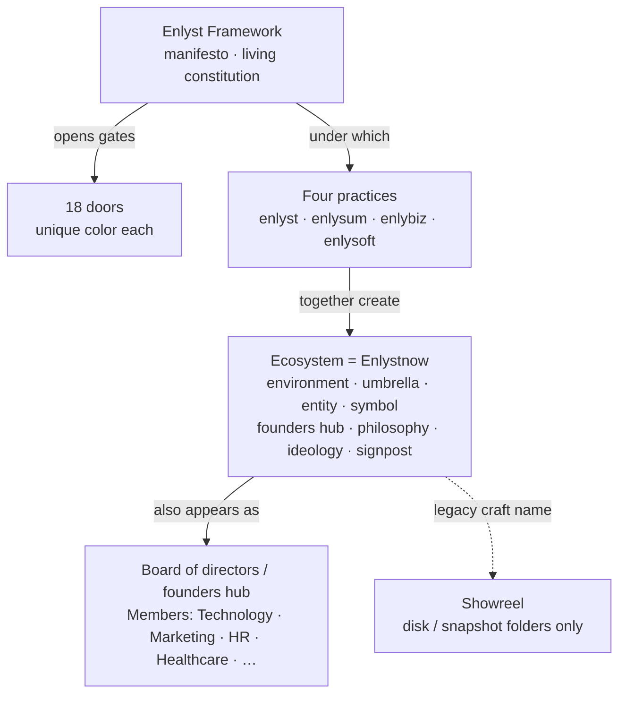

# VISION — Enlyst Ontology (unequivocal)

**Status:** Binding centerpiece · read before every DS, mandate, or public-surface edit  
**Updated:** 2026-08-06  
**Canonical twin:** [docs/ENLYSTNOW_ONTOLOGY.md](docs/ENLYSTNOW_ONTOLOGY.md)

---

## The vision in one breath

The **Enlyst Framework** is the manifesto and living constitution. It enables the ecosystem to thrive and **opens the gates to eighteen doors**. Under that constitution, four practices — **enlyst**, **enlysum**, **enlybiz**, **enlysoft** — operate. Together those practices **create** the **Ecosystem environment**. That environment **is Enlystnow**. Its legacy craft name was **Showreel**.

**Additional face (same referent):** Enlystnow may also be understood as a **board of directors / founders hub** whose seats are domain **Members** (Technology, Marketing, HR, Healthcare, and other seats as applicable). That face is a synonym for umbrella / entity / founders hub / signpost — **not** a parent company above the practices and **not** a consumer brand.

**Do not invert this diagram.** Ecosystem is not above the practices. Enlystnow is not above the practices. The board face does not create a Holding. Framework is not a consumer homepage.

---

## Authoritative definitions

| Term | What it IS | What it is NOT |
|------|------------|----------------|
| **Enlyst Framework** | Manifesto · living constitution. Enables Ecosystem to thrive. Opens gates to **18 doors**. Gold chrome. | A Holding · a consumer brand site · a fifth practice |
| **Four practices** | enlyst · enlysum · enlybiz · enlysoft — create the Ecosystem **environment** under the Framework | Sub-brands of “Enlystnow Inc.” stacked under a Holding |
| **Ecosystem** | The **environment** the four practices create together | A layer above the practices · a consumer product |
| **Enlystnow** | **= Ecosystem** — umbrella, entity, symbol, founders hub, philosophy, ideology, signpost; **also** board-of-directors face with domain Members | A consumer brand sold on practice pages · “above the arms” · a Holding |
| **Board / Members** | Institutional face of Enlystnow: domain seats (Technology, Marketing, HR, Healthcare, …) under the founders hub | A parent org chart above practices · invented fifth–Nth practice brands |
| **Showreel** | **Legacy craft name** for the Ecosystem / Enlystnow layer (folders, CSS filenames on disk) | Current public product name |
| **18 doors** | Sector gates the Framework opens — each with a **beautifully defined unique color**; motion and craft apply here | Generic accent chips · board seats (doors ≠ Members) |

---

## Unequivocal rules (never contradict)

1. **Framework first (constitutionally)** — manifesto / living constitution; opens 18 doors; enables the Ecosystem to thrive.  
2. **Practices create the environment** — Ecosystem is the field they create, not a parent company above them.  
3. **Ecosystem = Enlystnow** — same thing. Prefer “Ecosystem” / “Enlystnow Ecosystem” in public craft docs; use “Showreel” only for legacy disk paths.  
4. **Never Holding** — forbidden in public copy and DS framing.  
5. **Never Enlystnow-as-consumer-brand** on practice pages — practice voice stays (e.g. enlyst = Smart Recruiting); craft comes from the Enlystnow Ecosystem bar.  
6. **Domain ≠ brand** — `enlystnow.com` root is the **enlyst** practice. `/ecosystem/` is the Enlystnow Ecosystem showcase.  
7. **Board face is a synonym, not a stack** — Members sit *as* Enlystnow’s institutional face; they do not sit above the practices that create Enlystnow. See [docs/ENLYSTNOW_ONTOLOGY.md](docs/ENLYSTNOW_ONTOLOGY.md) § Board.  
8. **Wordmark** — Instrument Serif **weight 400 only**; `font-synthesis: none` (curly-y fix). Static logo; motion elsewhere.  
9. **18 doors** — unique `--door-NN-*` colors; door theatre receives motion and craft.

---

## Craft expression of this vision

| Layer | Expression |
|-------|------------|
| Framework | Gold (`#C4A24A`) · door 05 · badge **never spins** |
| Practices | Unique accents · public hosts · practice-native copy |
| Ecosystem / Enlystnow | `/ecosystem/` · cinematic intensity · full craft stage |
| 18 doors | Unique colors from Ecosystem snapshot · door planes · maps |
| Practice pages | Inherit **16 locked craft patterns** (Enlystnow Ecosystem craft) |

Locked stack: [docs/INVENTION_MANDATE.md](docs/INVENTION_MANDATE.md) §4 · [patterns/craft-stack.json](patterns/craft-stack.json) · preview [preview/ds-index.html](preview/ds-index.html).

---

## Synonyms for Ecosystem / Enlystnow (internal & docs)

Use freely when clarifying identity — **never** to imply a layer above the practices:

environment · umbrella · entity · symbol · founders hub · philosophy · ideology · signpost · **board of directors** (with domain **Members**)

---

## Read next

0. This file (`VISION.md`)  
1. [docs/ENLYSTNOW_ONTOLOGY.md](docs/ENLYSTNOW_ONTOLOGY.md)  
2. [docs/INVENTION_MANDATE.md](docs/INVENTION_MANDATE.md)  
3. [01-TAXONOMY.md](01-TAXONOMY.md) · [05-FRAMEWORK-ADMIN.md](05-FRAMEWORK-ADMIN.md) · [08-ECOSYSTEM-SHOWCASE.md](08-ECOSYSTEM-SHOWCASE.md)  
4. Tokens · patterns · [preview/ds-index.html](preview/ds-index.html)
